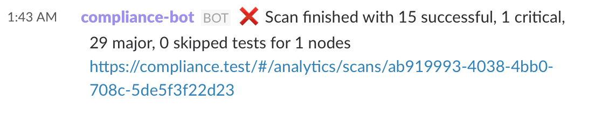

# Slack Bot for Chef Compliance

This project implements a Slack Bot for Chef Compliance. It polls the [Compliance API](https://docs.chef.io/release/compliance/api_compliance.html) to retrieve scan updates. Once the bot found a change, it will push an update to a Slack channel.

## Getting started

```
COMPLIANCE_SERVER=https://compliance.test SLACK_CHANNEL=chris-rock-test COMPLIANCE_ORGS=admin COMPLIANCE_TOKEN='eyJ...ozg' node cc-slack-bot.js
```

## Messages

Once everything is setup, you'll recieve a message for every scan with the results:



## References

 * https://api.slack.com/bot-users
 * https://github.com/slackhq/node-slack-sdk


## License

| **Author:**          | Christoph Hartmann (<chris@lollyrock.com>)

| **Copyright:**       | Copyright (c) 2016 Christoph Hartmann

| **License:**         | Apache License, Version 2.0

Licensed under the Apache License, Version 2.0 (the "License");
you may not use this file except in compliance with the License.
You may obtain a copy of the License at

    http://www.apache.org/licenses/LICENSE-2.0

Unless required by applicable law or agreed to in writing, software
distributed under the License is distributed on an "AS IS" BASIS,
WITHOUT WARRANTIES OR CONDITIONS OF ANY KIND, either express or implied.
See the License for the specific language governing permissions and
limitations under the License.
